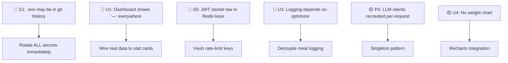

# MessFit — Production-Readiness Audit

> **Auditor perspective**: Principal Software Engineer + Lead UI/UX Product Designer
> **Date**: 2026-06-18
> **Scope**: Full codebase — `services/api/`, `apps/web/`, `infra/`, `docs/`, config files

---

## Executive Verdict

MessFit is **significantly above-average for a student/club project** — the modular monolith with hexagonal contracts, ADRs, a real test suite (279+ tests), OTEL + Sentry + PII scrubbing, and DPDP-compliant account deletion puts it ahead of 90% of early-stage projects I've reviewed. That said, it has real gaps that would block a safe, scalable pilot. This report is ruthlessly constructive — every flaw below comes with a fix.

---

## 1. Architectural & Code Quality Audit

### 1.1 Directory Structure — ✅ Mostly Excellent

The monorepo layout is clean and scalable:

```
Mess-Fit/
├── apps/web/           ← Next.js 16 PWA (frontend)
├── services/api/       ← FastAPI modular monolith
├── infra/              ← Grafana dashboards + k6 load tests
├── docs/               ← PRD, TDD, ADRs, runbooks
├── packages/           ← (empty — reserved for shared libs)
└── workers/            ← (empty — reserved for future workers)
```

**Strengths**:
- Per-domain packages inside `messfit_api/` (profile, mess, optimizer, workouts, tracking, chatbot, account, observability) give clean separation
- Each domain follows a consistent `models.py` / `schemas.py` / `repository.py` / `router.py` pattern
- ADRs document every major technical decision
- Runbooks for incident response, deploy/rollback, secrets rotation — production ops thinking

**Issues**:

| # | Issue | Severity | Location |
|---|-------|----------|----------|
| A1 | `packages/` and `workers/` are empty directories with no `.gitkeep` — confusing for new contributors | Low | Root |
| A2 | The `scripts/extract_pdf.py` has a **hardcoded absolute Windows path** — breaks on any other machine | Medium | [extract_pdf.py](file:///c:/Users/mahakisore/Skills/Clubs/Idea%20Club/Projects/Mess-Fit/scripts/extract_pdf.py#L10) |
| A3 | Root `package.json` has `"main": "index.js"` and `"test": "echo Error..."` — it's a pnpm workspace root, not a package. These are confusing dead fields | Low | [package.json](file:///c:/Users/mahakisore/Skills/Clubs/Idea%20Club/Projects/Mess-Fit/package.json#L5-L7) |
| A4 | No `eslint` or `prettier` config at the monorepo root — formatting consistency depends on each dev's editor | Medium | Root |

### 1.2 Code Practices — DRY, SOLID, Separation of Concerns

#### ✅ What's Done Well

- **Pure functions for business logic**: `goal_engine.py` and `tracking/metrics.py` are textbook examples — no I/O, no DB, deterministic, easy to test. This is rare and correct.
- **Hexagonal optimizer contracts**: [contracts.py](file:///c:/Users/mahakisore/Skills/Clubs/Idea%20Club/Projects/Mess-Fit/services/api/messfit_api/optimizer/contracts.py) uses frozen dataclasses as ports — the solver has zero knowledge of SQLAlchemy, Redis, or FastAPI.
- **Auth is layered correctly**: `get_current_user_id` → `get_active_user_id` → `require_admin` composes cleanly. DB is the source of truth for roles, not JWT claims.
- **Idempotent writes everywhere**: `ON CONFLICT DO UPDATE` on every log/upsert — crash-safe, no duplicates.

#### 🔴 Anti-Patterns & Code Smells

**A5. `mess/routes.py` is a 436-line god file** — it mixes CRUD, OCR job management, admin approvals, and draft dish creation in a single router. This violates SRP and will get worse.

```python
# BEFORE: one massive routes.py with 15 endpoints + private helpers
# mess/routes.py — 436 lines, 7 concerns mixed

# AFTER: split into 3 focused routers
# mess/routes.py       — public menu + dish endpoints (~80 lines)
# mess/admin_routes.py — admin CRUD (mess/dish creation) (~60 lines)  
# mess/ocr_routes.py   — OCR job lifecycle (~200 lines)
```

**A6. `type: ignore[attr-defined]` scattered through chatbot router** — the `_profile_summary` function accesses `profile.dob`, `profile.sex`, etc. via `# type: ignore[attr-defined]` because it types the param as `object | None`. This is a mypy escape hatch that hides real bugs.

```python
# BEFORE — file: chatbot/router.py:40-61
def _profile_summary(profile: object | None, today: date) -> str:
    targets = compute_targets(
        dob=profile.dob,  # type: ignore[attr-defined]
        ...
    )

# AFTER — type it properly
from ..profile.models import ProfileORM

def _profile_summary(profile: ProfileORM | None, today: date) -> str:
    if profile is None:
        return "User profile: not set up yet."
    targets = compute_targets(
        dob=profile.dob,
        sex=profile.sex,
        ...  # no type ignores needed
    )
```

**A7. Celery beat task name mismatch** — [celery_app.py:51](file:///c:/Users/mahakisore/Skills/Clubs/Idea%20Club/Projects/Mess-Fit/services/api/messfit_api/celery_app.py#L51) registers `"task": "messfit.account.hard_delete_pending"` but the actual task in `account/tasks.py` likely uses `@celery_app.task(name=...)` with a different dotted path. If these don't match, the beat schedule silently does nothing. Verify the `name=` attribute matches exactly.

**A8. No service-layer abstraction** — routers directly call repository functions and stitch business logic inline. For simple CRUD this is fine, but the optimizer and chatbot flows are complex enough that a `service.py` would improve testability and prevent routers from accumulating orchestration logic.

**A9. `docker-compose.yml` uses deprecated `version: '3.9'`** — Compose V2 ignores this field and prints a warning. Remove it.

### 1.3 Error Handling & Logging

| # | Issue | Severity |
|---|-------|----------|
| A10 | Backend uses `structlog` as a dependency but most modules use plain `logging.getLogger()` (see [llm.py:18](file:///c:/Users/mahakisore/Skills/Clubs/Idea%20Club/Projects/Mess-Fit/services/api/messfit_api/chatbot/llm.py#L18), [cache.py:43](file:///c:/Users/mahakisore/Skills/Clubs/Idea%20Club/Projects/Mess-Fit/services/api/messfit_api/optimizer/cache.py#L43)). You're paying for structlog but not using it — pick one and be consistent | Medium |
| A11 | Frontend `ApiError` class doesn't log errors. Failed fetches silently throw — no `console.error`, no Sentry capture on the client side for API errors | Medium |
| A12 | No global exception handler on FastAPI for unhandled 500s (beyond Sentry). Consider a middleware that returns a consistent JSON error shape instead of FastAPI's default HTML error page | Medium |

### 1.4 State Management

**Backend**: Single async SQLAlchemy engine + one session per request is correct and clean. The Zustand onboarding store with `sessionStorage` persistence is appropriate for multi-step forms.

**Frontend**: TanStack Query for server state, Zustand for ephemeral UI state — this is the right split. However:

| # | Issue | Severity |
|---|-------|----------|
| A13 | The dashboard page fetches user data via `supabase.auth.getUser()` inside a `useEffect` — this is a client-side waterfall. Every protected page independently fetches the user. Extract a `useUser()` hook with TanStack Query that caches the user once | Low |
| A14 | `staleTime: 30_000` globally — progress data and plate results should have different staleness. Progress can be `5min`, plate should be `0` (always fresh) | Low |

---

## 2. Security & Performance Profiling

### 2.1 Security

> [!CAUTION]
> **S1. The `.env` file is committed to the repo** — [services/api/.env](file:///c:/Users/mahakisore/Skills/Clubs/Idea%20Club/Projects/Mess-Fit/services/api/.env) is a 902-byte file in the working tree. If this has ever been committed to git history, **every secret (DB password, API keys, JWT secret) is compromised**. Rotate ALL secrets immediately and add `services/api/.env` to `.gitignore` (the root `.gitignore` may already have `*.env` but verify it actually covers this path).

| # | Issue | Severity |
|---|-------|----------|
| S2 | **CORS allows wildcard methods/headers** (`allow_methods=["*"]`, `allow_headers=["*"]`). For a health-data app, allowlist only `GET, POST, PUT, DELETE, OPTIONS` and `Content-Type, Authorization` | High |
| S3 | **No CSRF protection** — Supabase uses cookie-based sessions on the frontend, but the backend relies solely on Bearer tokens. If any endpoint also accepts cookies, you're vulnerable. Verify that no endpoint reads auth from cookies | Medium |
| S4 | **SQL injection surface in dish search** — [mess/routes.py:71](file:///c:/Users/mahakisore/Skills/Clubs/Idea%20Club/Projects/Mess-Fit/services/api/messfit_api/mess/routes.py#L71) uses `DishORM.name.ilike(f"%{query}%")` which is safe because SQLAlchemy parameterizes it, but the `%` in user input isn't escaped. A user searching for `%` gets all dishes. Not a security hole but a data-leak vector — escape `%` and `_` in the query | Low |
| S5 | **Rate limit key leaks the full auth token** — [ratelimit.py:30](file:///c:/Users/mahakisore/Skills/Clubs/Idea%20Club/Projects/Mess-Fit/services/api/messfit_api/observability/ratelimit.py#L30) uses `request.headers.get("authorization")` as the Redis key. If rate-limit storage leaks, every user's JWT is exposed. Hash the token first | High |
| S6 | **No input size limits on chatbot** — `MessageIn.content` has no `max_length`. A user can send a 1MB message that gets embedded, retrieved, and sent to the LLM. Add `max_length=2000` | Medium |
| S7 | **PII scrubbing is solid** — Sentry `scrub_pii` strips bodies, cookies, auth headers, email addresses. The `send_default_pii=False` is correct. Well done | ✅ |
| S8 | **DPDP account deletion with 30-day grace period** — correct implementation with soft delete + Celery beat hard delete. The `get_active_user_id` dependency blocks deleted users | ✅ |

```python
# FIX for S5 — hash the auth token in the rate-limit key
import hashlib

def _rate_key(request: Request) -> str:
    auth = request.headers.get("authorization")
    if auth:
        return f"auth:{hashlib.sha256(auth.encode()).hexdigest()[:16]}"
    return get_remote_address(request)
```

### 2.2 Performance

| # | Issue | Severity |
|---|-------|----------|
| P1 | **Optimizer runs synchronously in the Celery task** — `solver.optimize()` is CPU-bound (MILP solver with a 5s timeout). On the FastAPI event loop, this would block, but it's correctly offloaded to Celery. However, the HTTP endpoint in `optimizer/routes.py` may also call it inline — verify it always delegates to the task | High |
| P2 | **N+1 queries in workout_today** — [workouts/router.py:91](file:///c:/Users/mahakisore/Skills/Clubs/Idea%20Club/Projects/Mess-Fit/services/api/messfit_api/workouts/router.py#L91) fetches exercises with `ExerciseORM.id.in_(ids)` which is correct (batch), but `_find_day` iterates nested JSON structure linearly. For 16 templates this is fine, but the pattern doesn't scale | Low |
| P3 | **No pagination on list endpoints** — `list_messes`, `list_conversations`, `list_ocr_jobs` return all rows. For a pilot with <100 users this is fine, but add `limit`/`offset` before scaling | Medium |
| P4 | **LLM client created on every request** — [llm.py:116](file:///c:/Users/mahakisore/Skills/Clubs/Idea%20Club/Projects/Mess-Fit/services/api/messfit_api/chatbot/llm.py#L116) creates `genai.Client()` and [llm.py:138](file:///c:/Users/mahakisore/Skills/Clubs/Idea%20Club/Projects/Mess-Fit/services/api/messfit_api/chatbot/llm.py#L138) creates `AsyncGroq()` inside the generation functions. These should be module-level singletons to reuse HTTP connection pools | Medium |
| P5 | **Frontend loads Recharts, Lucide, and Hugeicons** — you're shipping two icon libraries. Pick one. Hugeicons is already used consistently; remove Lucide (saves ~50KB gzipped) | Medium |
| P6 | **No `next/dynamic` or lazy loading** for heavy dashboard pages — the chat, plate, and progress pages load all their code upfront. Use dynamic imports for pages behind navigation | Low |
| P7 | **No database connection pooling configuration** — the engine uses `pool_pre_ping=True` but no `pool_size`, `max_overflow`, or `pool_recycle`. For Supabase's connection pooler (PgBouncer), set `pool_size=5, max_overflow=10, pool_recycle=1800` | Medium |

```python
# FIX for P4 — singleton LLM clients
# chatbot/llm.py (module level)
from functools import lru_cache

@lru_cache(maxsize=1)
def _gemini_client():
    from google import genai
    return genai.Client(api_key=settings.gemini_api_key)

@lru_cache(maxsize=1)
def _groq_client():
    from groq import AsyncGroq
    return AsyncGroq(api_key=settings.groq_api_key)
```

---

## 3. UI/UX & Product Design Review

### 3.1 What's Working

- **Dark + amber design system** is cohesive and premium. The CSS custom properties in [globals.css](file:///c:/Users/mahakisore/Skills/Clubs/Idea%20Club/Projects/Mess-Fit/apps/web/src/app/globals.css) create a real token system
- **Landing page** has good visual hierarchy — gradient text, grid background, glassmorphism cards
- **Mobile-first shell** with bottom tab bar + "More" sheet is the right pattern for a fitness app used mid-meal
- **Onboarding flow** uses Zustand with sessionStorage persistence — the user can navigate back without losing data
- **Skeleton loading states** on every data-fetching page — no layout shift

### 3.2 Critical UX Issues

| # | Issue | Impact |
|---|-------|--------|
| U1 | **Dashboard stat cards show "—" permanently** — [dashboard/page.tsx:39-57](file:///c:/Users/mahakisore/Skills/Clubs/Idea%20Club/Projects/Mess-Fit/apps/web/src/app/dashboard/page.tsx#L39-L57) hardcodes `value="—"` for Calories, Protein, and Meals logged. These are never wired to real data. The dashboard — the most-visited page — feels broken | 🔴 Critical |
| U2 | **No haptic/visual feedback on meal logging** — tapping "As planned" changes the button color but has no toast, no animation, no haptic. For a logging action done 4x/day, this needs microinteraction feedback. The `toast.success()` is used on weight/workout but not on meal log success | High |
| U3 | **Log page forces optimizer fetch** — the meal tab calls `optimizeToday()` just to show dish names. If the optimizer fails (no mess selected, infeasible), the meal tab shows an error. Meal logging should work independently of the optimizer | High |
| U4 | **No progress data visualization** — the progress page exists but I see no Recharts charts being used for the weight trend. The `weight_series` data is fetched but not plotted | High |
| U5 | **Plate page has no "Log this meal" shortcut** — after seeing the plate, the user must navigate to `/dashboard/log`, find the right meal, then tap "As planned". Add a "Log as planned" button on each meal section of the plate | Medium |
| U6 | **Chat page has no conversation list UI** — the backend supports multiple conversations, but the frontend likely only shows the current one. Users can't review past conversations | Medium |

### 3.3 Personalization & Onboarding UX

| # | Suggestion | Impact |
|---|-----------|--------|
| U7 | The targets page after onboarding shows raw numbers. Add a **"What this means for you"** card — e.g., "You'll eat about 2200 kcal/day, roughly 4 idlis + a katori sambar per meal" — grounding abstract numbers in familiar mess food | High |
| U8 | No **weekly check-in flow** — weight logging is buried in the Log tab. A Sunday evening prompt ("Quick weigh-in?") with a single number input would drive retention and feed the projection algorithm | High |
| U9 | **Onboarding doesn't show a preview plate** — after the user enters all their data, immediately show one optimized plate. This is the "aha moment" and it's buried behind navigation | High |

### 3.4 Accessibility (a11y)

| # | Issue | WCAG |
|---|-------|------|
| A15 | **No `aria-label` on icon-only buttons** — the plate refresh button, the "More" bottom tab, and the meal section icons lack accessible names. Screen readers announce nothing | 2.1 AA |
| A16 | **Color contrast** — `text-muted-foreground` (`#a1a1aa`) on `--bg` (`#08080a`) is 6.6:1 ✅, but `text-muted` (`#5e5e68`) on `--bg` is only **3.3:1** — fails WCAG AA for normal text. Lighten `--text-muted` to at least `#767680` | 1.4.3 AA |
| A17 | **No `prefers-reduced-motion` coverage** for Tailwind transitions — only the custom `mf-rise` animation respects it. Wrap all `transition-*` classes in a reduced-motion media query or disable them globally | 2.3.3 AAA |
| A18 | **No skip-to-content link** on the dashboard shell — keyboard users must tab through the entire sidebar before reaching content | 2.4.1 A |
| A19 | **Emoji-based mood scale** (`🥱😪😐😊🚀`) lacks text labels — screen readers announce Unicode names ("yawning face") which don't map to energy levels | 1.1.1 A |

---

## 4. The "Missing Features" Gap Analysis

### 4.1 vs. Top-Tier Competitors

| Feature | MyFitnessPal | MacroFactor | Apple Fitness | **MessFit** |
|---------|:---:|:---:|:---:|:---:|
| Barcode food scanner | ✅ | ✅ | — | ❌ |
| Photo-based meal logging | ✅ (AI) | ❌ | — | ❌ (OCR is admin-only for menus) |
| Adaptive TDEE algorithm | ❌ | ✅ | — | ❌ |
| Social/accountability | ✅ | ❌ | ✅ | ❌ |
| Wearable integration | ✅ | ✅ | ✅ | ❌ |
| Push notifications | ✅ | ✅ | ✅ | ❌ |
| Offline-first data entry | ✅ | ✅ | ✅ | ❌ |
| Recipe/multi-ingredient meals | ✅ | ✅ | — | ❌ |
| Water tracking | ✅ | ❌ | ✅ | ❌ |
| Sleep tracking | ❌ | ❌ | ✅ | ❌ |

### 4.2 Critical Missing Features (Must-Have for Pilot)

1. **Push notifications / reminders** — Meal logging drops off without "Time to log lunch!" prompts. The PWA manifest exists but no service worker for push. This is the #1 retention lever
2. **Offline meal logging** — Hostel WiFi is unreliable. Service worker with background sync for log mutations would make logging work in dining halls with poor connectivity
3. **Meal logging without optimizer dependency** — Currently the Log page requires the optimizer to succeed. If the mess has no menu for today, logging breaks entirely

### 4.3 High-Impact Differentiating Features

> [!TIP]
> These features would make MessFit genuinely stand out from generic fitness apps — they leverage the unique constraint of mess-based eating.

#### 🌟 1. **Adaptive TDEE Engine** (MacroFactor's Killer Feature)
Instead of static Mifflin-St Jeor, use the user's weight trend + calorie logs to compute their *actual* TDEE week-by-week. This is a significant algorithmic upgrade but can be built on top of the existing `tracking/metrics.py` infrastructure.

```python
# New file: profile/adaptive_tdee.py
def compute_adaptive_tdee(
    weight_series: list[WeightPoint],
    calorie_logs: list[MealRow],
    initial_tdee: float,
    window_days: int = 14,
) -> float:
    """Adaptive TDEE from energy balance equation:
    actual_tdee ≈ avg_intake - (weight_change * 7700 / days)
    Exponentially weighted to emphasize recent data.
    """
    # ... implementation
```

#### 🌟 2. **Mess Menu Crowdsourcing** (Community-Driven Data)
Let users confirm/correct today's menu with a one-tap "This is what's being served" feature. Reduces admin burden, ensures menu accuracy, and creates community engagement. The `dish_exclusions` table already supports per-user, per-date dish marking — extend it to "dish confirmations."

#### 🌟 3. **"What Should I Grab?" Quick Mode** (Contextual Micro-Interaction)
A single-screen widget that answers: "I'm in the mess right now, what should I eat?" — shows only the current meal's optimized plate with portions, no navigation required. Implement as a PWA home screen widget or a dedicated `/quick` route that auto-detects the current meal slot.

---

## 5. Actionable Roadmap

### Priority Legend
- 🔴 **P0 — Block pilot launch** (do this first)
- 🟡 **P1 — First week post-launch** (high-impact, medium effort)
- 🟢 **P2 — First month** (polish, scale)
- 🔵 **P3 — V2** (differentiation)

---

### Phase A: Pre-Pilot Hardening (P0) — ~2-3 days

| # | Task | Issue Ref | Effort |
|---|------|-----------|--------|
| 1 | **Rotate all secrets** — verify `.env` is gitignored, check git history for leaked credentials, rotate Supabase JWT secret + API keys | S1 | 1h |
| 2 | **Wire dashboard stat cards to real data** — fetch today's plate + logs on the dashboard, compute totals | U1 | 3h |
| 3 | **Fix CORS to allowlist specific methods/headers** | S2 | 30m |
| 4 | **Hash rate-limit keys** — don't store raw JWTs in Redis | S5 | 30m |
| 5 | **Add `max_length=2000` to chatbot `MessageIn`** | S6 | 15m |
| 6 | **Decouple meal logging from optimizer** — log tab should work even if no plate is available | U3 | 2h |
| 7 | **Add toasts to meal logging success** | U2 | 30m |

### Phase B: UX Polish (P1) — ~3-5 days

| # | Task | Issue Ref | Effort |
|---|------|-----------|--------|
| 8 | **Build weight trend chart** on progress page using Recharts | U4 | 4h |
| 9 | **Add "Log as planned" button to plate page** | U5 | 2h |
| 10 | **Add pagination** to conversations, OCR jobs, dish list | P3 | 3h |
| 11 | **Create singleton LLM clients** | P4 | 1h |
| 12 | **Consolidate to one icon library** (remove Lucide, keep Hugeicons) | P5 | 2h |
| 13 | **Fix a11y** — aria-labels, color contrast, skip-to-content, emoji labels | A15-A19 | 3h |
| 14 | **Split mess/routes.py** into focused routers | A5 | 2h |
| 15 | **Fix chatbot type ignores** — type `_profile_summary` properly | A6 | 30m |

### Phase C: Production Scaling (P2) — ~1-2 weeks

| # | Task | Issue Ref | Effort |
|---|------|-----------|--------|
| 16 | **PWA push notifications** — service worker + Supabase Edge Function for scheduled meal reminders | Missing | 3-4 days |
| 17 | **Offline meal logging** with service worker + background sync | Missing | 2-3 days |
| 18 | **Database connection pool tuning** — `pool_size`, `max_overflow`, `pool_recycle` | P7 | 1h |
| 19 | **Configure `disallow_untyped_defs = true` in mypy** and fix all untyped functions | pyproject.toml | 4h |
| 20 | **Add frontend E2E tests** (Playwright) — onboarding flow, log a meal, view plate | Missing | 2 days |
| 21 | **Standardize logging** — either commit to structlog or remove it; add request_id correlation | A10 | 3h |
| 22 | **Add global FastAPI exception handler** for consistent JSON error responses | A12 | 1h |
| 23 | **Weekly check-in prompt flow** — Sunday evening nudge to weigh in | U8 | 1 day |

### Phase D: Differentiation (P3) — V2

| # | Task | Issue Ref | Effort |
|---|------|-----------|--------|
| 24 | **Adaptive TDEE engine** — replace static Mifflin-St Jeor with data-driven TDEE | Feature | 1 week |
| 25 | **Mess menu crowdsourcing** — user confirmations of today's menu | Feature | 3-4 days |
| 26 | **"Quick Mode" widget** — current meal plate in one screen | Feature | 2 days |
| 27 | **Photo-based meal logging** — user-facing (not admin) food photo → macro estimation | Feature | 1 week |
| 28 | **Social accountability** — hostel/floor leaderboards for streak days | Feature | 3-4 days |

---

## Summary of Critical Findings



### Scorecard

| Area | Score | Notes |
|------|:-----:|-------|
| **Architecture** | 8/10 | Modular monolith with hexagonal optimizer is excellent. Minor cleanup needed |
| **Code Quality** | 7/10 | Pure-function business logic is A+. Some type-safety gaps, one god file |
| **Security** | 6/10 | PII scrubbing and DPDP compliance are strong. CORS, rate-limit key, and potential .env leak are concerning |
| **Performance** | 7/10 | Redis caching, Celery offload are correct. LLM client lifecycle, missing pagination, no lazy loading |
| **UI/UX** | 6/10 | Design system is premium. Dashboard not wired, logging depends on optimizer, no charts, weak a11y |
| **Test Coverage** | 8/10 | 279+ backend tests, proper fixtures, test-data hygiene. No frontend tests at all |
| **Documentation** | 9/10 | PRD, TDD, 8 ADRs, 5 runbooks. One of the best-documented student projects I've seen |
| **Production Readiness** | 6/10 | Blocked by security issues and unwired dashboard. 2-3 days of P0 work gets it to "safe to pilot" |

> **Overall**: MessFit is a well-architected project with strong engineering fundamentals (pure functions, hexagonal ports, proper auth, observability). The gaps are primarily in the **last-mile UX** (unwired dashboard, optimizer-coupled logging) and **security hygiene** (CORS, rate-limit keys, potential secret leak). Fix the P0 items and this is a genuinely impressive, pilot-ready product.
