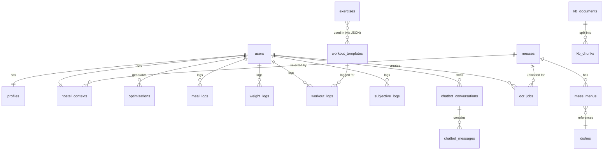

# MessFit — Database Schema

| | |
|---|---|
| **Version** | 1.0 |
| **DB Engine** | PostgreSQL 16 + pgvector extension |
| **Migration tool** | Alembic |
| **Hosting** | Supabase |

This document is the single source of truth for the database schema. Every migration must update this document.

---

## 1. Conventions

- **Naming:** `snake_case` for all identifiers (tables, columns, indexes, constraints)
- **Primary keys:** `id UUID PRIMARY KEY DEFAULT gen_random_uuid()` unless otherwise noted
- **Timestamps:** Every table has `created_at TIMESTAMPTZ NOT NULL DEFAULT NOW()` and `updated_at TIMESTAMPTZ NOT NULL DEFAULT NOW()` (with trigger to auto-update)
- **Soft delete:** Not used. Hard deletes only (DPDP Act compliance).
- **Foreign keys:** All FKs have explicit `ON DELETE` behavior — `CASCADE` for owned records, `RESTRICT` for references.
- **Enums:** Stored as `TEXT` with `CHECK` constraints (Postgres native enums are painful to migrate).

---

## 2. Extensions

```sql
CREATE EXTENSION IF NOT EXISTS "pgcrypto";   -- gen_random_uuid()
CREATE EXTENSION IF NOT EXISTS "vector";     -- pgvector for embeddings
CREATE EXTENSION IF NOT EXISTS "pg_trgm";    -- fuzzy dish name match
```

---

## 3. Migration Order

Migrations must run in this order (foreign-key dependencies):

1. `001_extensions` — extensions above
2. `002_users` — users table (synced from Supabase auth)
3. `003_messes` — messes table
4. `004_dishes` — dishes table
5. `005_profiles` — profiles + hostel_contexts
6. `006_mess_menus` — menus reference messes + dishes
7. `007_optimizations` — optimizer cache
8. `008_logs` — meal/weight/workout/subjective logs
9. `009_workouts` — exercises + workout_templates
10. `010_chatbot` — conversations + messages + KB
11. `011_indexes` — performance indexes
12. `012_rls` — row-level security policies
13. `013_seeds` — seed data (Amrita messes, exercises, articles)

---

## 4. ER Diagram



---

## 5. Table Specifications

### 5.1 `users`

Synced one-to-one from Supabase auth. Created via trigger when a Supabase auth user is created.

```sql
CREATE TABLE users (
  id            UUID PRIMARY KEY,                     -- matches auth.users(id)
  email         TEXT NOT NULL UNIQUE,
  display_name  TEXT,
  role          TEXT NOT NULL DEFAULT 'user'
                CHECK (role IN ('user', 'admin')),
  onboarded_at  TIMESTAMPTZ,                          -- NULL until profile complete
  created_at    TIMESTAMPTZ NOT NULL DEFAULT NOW(),
  updated_at    TIMESTAMPTZ NOT NULL DEFAULT NOW()
);

CREATE TRIGGER trg_users_updated_at
  BEFORE UPDATE ON users
  FOR EACH ROW EXECUTE FUNCTION set_updated_at();
```

### 5.2 `profiles`

```sql
CREATE TABLE profiles (
  user_id                  UUID PRIMARY KEY
                           REFERENCES users(id) ON DELETE CASCADE,
  dob                      DATE NOT NULL,
  sex                      TEXT NOT NULL
                           CHECK (sex IN ('male', 'female', 'other')),
  height_cm                NUMERIC(5,2) NOT NULL
                           CHECK (height_cm BETWEEN 120 AND 220),
  current_weight_kg        NUMERIC(5,2) NOT NULL
                           CHECK (current_weight_kg BETWEEN 30 AND 200),
  target_weight_kg         NUMERIC(5,2) NOT NULL
                           CHECK (target_weight_kg BETWEEN 30 AND 200),
  target_rate_kg_per_week  NUMERIC(3,2) NOT NULL
                           CHECK (target_rate_kg_per_week BETWEEN -0.5 AND 0.5),
  goal                     TEXT NOT NULL
                           CHECK (goal IN ('lose', 'maintain', 'gain')),
  activity_level           INT NOT NULL
                           CHECK (activity_level BETWEEN 1 AND 5),
  diet_type                TEXT NOT NULL
                           CHECK (diet_type IN ('veg', 'eggetarian', 'non_veg', 'jain')),
  allergies                TEXT[] NOT NULL DEFAULT '{}',
  conditions               TEXT[] NOT NULL DEFAULT '{}',
  created_at               TIMESTAMPTZ NOT NULL DEFAULT NOW(),
  updated_at               TIMESTAMPTZ NOT NULL DEFAULT NOW()
);

CREATE TRIGGER trg_profiles_updated_at BEFORE UPDATE ON profiles
  FOR EACH ROW EXECUTE FUNCTION set_updated_at();
```

**Allowed values:**
- `allergies`: `lactose`, `gluten`, `nuts`, `soy`, `eggs`, `seafood`, `mustard`, `sesame`
- `conditions`: `diabetes`, `hypertension`, `pcos`, `ibs`, `gerd`, `anemia`, `hypothyroid`

### 5.3 `messes`

```sql
CREATE TABLE messes (
  id          UUID PRIMARY KEY DEFAULT gen_random_uuid(),
  name        TEXT NOT NULL,
  college     TEXT NOT NULL,
  city        TEXT NOT NULL,
  seeded_by   UUID REFERENCES users(id) ON DELETE SET NULL,
  created_at  TIMESTAMPTZ NOT NULL DEFAULT NOW(),
  updated_at  TIMESTAMPTZ NOT NULL DEFAULT NOW(),
  UNIQUE (college, name)
);

CREATE TRIGGER trg_messes_updated_at BEFORE UPDATE ON messes
  FOR EACH ROW EXECUTE FUNCTION set_updated_at();
```

### 5.4 `hostel_contexts`

```sql
CREATE TABLE hostel_contexts (
  user_id                    UUID PRIMARY KEY
                             REFERENCES users(id) ON DELETE CASCADE,
  mess_id                    UUID REFERENCES messes(id) ON DELETE RESTRICT,
  canteen_freq               TEXT NOT NULL
                             CHECK (canteen_freq IN ('never', 'rare', 'frequent', 'daily')),
  canteen_typical_spend_inr  INT NOT NULL DEFAULT 0
                             CHECK (canteen_typical_spend_inr >= 0),
  top_up_budget_inr_weekly   INT NOT NULL DEFAULT 0
                             CHECK (top_up_budget_inr_weekly >= 0),
  equipment                  TEXT[] NOT NULL DEFAULT '{}',
  workout_minutes_per_day    INT NOT NULL DEFAULT 30
                             CHECK (workout_minutes_per_day BETWEEN 0 AND 180),
  workout_days_per_week      INT NOT NULL DEFAULT 3
                             CHECK (workout_days_per_week BETWEEN 0 AND 7),
  gym_access_days            TEXT[] NOT NULL DEFAULT '{}',
  created_at                 TIMESTAMPTZ NOT NULL DEFAULT NOW(),
  updated_at                 TIMESTAMPTZ NOT NULL DEFAULT NOW()
);

CREATE TRIGGER trg_hostel_updated_at BEFORE UPDATE ON hostel_contexts
  FOR EACH ROW EXECUTE FUNCTION set_updated_at();
```

**Allowed values:**
- `equipment`: `bodyweight`, `bands`, `college_gym`, `home_gym`
- `gym_access_days`: subset of `mon`, `tue`, `wed`, `thu`, `fri`, `sat`, `sun`

### 5.5 `dishes`

The nutrition reference. Per-serving values.

```sql
CREATE TABLE dishes (
  id                      UUID PRIMARY KEY DEFAULT gen_random_uuid(),
  name                    TEXT NOT NULL,
  name_local              JSONB NOT NULL DEFAULT '{}'::jsonb,    -- {"ta": "...", "hi": "..."}
  category                TEXT NOT NULL
                          CHECK (category IN ('rice', 'roti', 'curry', 'sabzi', 'dal',
                                              'snack', 'sweet', 'beverage', 'protein', 'salad', 'other')),
  default_serving_unit    TEXT NOT NULL,
  default_serving_grams   NUMERIC(6,2) NOT NULL CHECK (default_serving_grams > 0),
  kcal                    NUMERIC(6,2) NOT NULL CHECK (kcal >= 0),
  protein_g               NUMERIC(5,2) NOT NULL CHECK (protein_g >= 0),
  carbs_g                 NUMERIC(5,2) NOT NULL CHECK (carbs_g >= 0),
  fats_g                  NUMERIC(5,2) NOT NULL CHECK (fats_g >= 0),
  fiber_g                 NUMERIC(5,2) NOT NULL DEFAULT 0,
  sodium_mg               NUMERIC(6,2) NOT NULL DEFAULT 0,
  glycemic_index          INT CHECK (glycemic_index BETWEEN 0 AND 110),
  allergens               TEXT[] NOT NULL DEFAULT '{}',
  tags                    TEXT[] NOT NULL DEFAULT '{}',
  portion_icon            TEXT NOT NULL DEFAULT 'katori'
                          CHECK (portion_icon IN ('katori', 'small_katori', 'fist',
                                                  'palm', 'thumb', 'cupped_hand',
                                                  'plate_quarter', 'piece', 'glass')),
  confidence              TEXT NOT NULL DEFAULT 'estimated'
                          CHECK (confidence IN ('verified', 'estimated', 'user_reported')),
  source                  TEXT,                                  -- 'IFCT_2017', 'manual', 'gemini_estimated'
  created_at              TIMESTAMPTZ NOT NULL DEFAULT NOW(),
  updated_at              TIMESTAMPTZ NOT NULL DEFAULT NOW(),
  UNIQUE (name, default_serving_unit)
);

CREATE TRIGGER trg_dishes_updated_at BEFORE UPDATE ON dishes
  FOR EACH ROW EXECUTE FUNCTION set_updated_at();
```

**Common tag values:** `high_protein`, `low_gi`, `high_iron`, `high_calcium`, `vegan`, `keto_friendly`, `low_sodium`.

### 5.6 `mess_menus`

```sql
CREATE TABLE mess_menus (
  id              UUID PRIMARY KEY DEFAULT gen_random_uuid(),
  mess_id         UUID NOT NULL REFERENCES messes(id) ON DELETE CASCADE,
  effective_from  DATE NOT NULL,
  effective_to    DATE,
  day_of_week     INT NOT NULL CHECK (day_of_week BETWEEN 0 AND 6),    -- 0=Mon..6=Sun
  meal_type       TEXT NOT NULL
                  CHECK (meal_type IN ('breakfast', 'lunch', 'snack', 'dinner')),
  dish_id         UUID NOT NULL REFERENCES dishes(id) ON DELETE RESTRICT,
  availability    TEXT NOT NULL DEFAULT 'usually'
                  CHECK (availability IN ('always', 'usually', 'sometimes')),
  created_at      TIMESTAMPTZ NOT NULL DEFAULT NOW(),
  updated_at      TIMESTAMPTZ NOT NULL DEFAULT NOW(),
  UNIQUE (mess_id, effective_from, day_of_week, meal_type, dish_id)
);

CREATE TRIGGER trg_mess_menus_updated_at BEFORE UPDATE ON mess_menus
  FOR EACH ROW EXECUTE FUNCTION set_updated_at();
```

### 5.7 `optimizations`

Cache table — one row per (user, date).

```sql
CREATE TABLE optimizations (
  user_id           UUID NOT NULL REFERENCES users(id) ON DELETE CASCADE,
  date              DATE NOT NULL,
  input_hash        TEXT NOT NULL,
  output_json       JSONB NOT NULL,
  solver_status     TEXT NOT NULL
                    CHECK (solver_status IN ('optimal', 'feasible', 'infeasible', 'error')),
  solve_time_ms     INT NOT NULL,
  total_kcal        NUMERIC(7,2),
  total_protein_g   NUMERIC(6,2),
  created_at        TIMESTAMPTZ NOT NULL DEFAULT NOW(),
  PRIMARY KEY (user_id, date)
);
```

Note: no `updated_at` — optimizations are immutable; we delete and re-insert.

### 5.8 `meal_logs`

```sql
CREATE TABLE meal_logs (
  id          UUID PRIMARY KEY DEFAULT gen_random_uuid(),
  user_id     UUID NOT NULL REFERENCES users(id) ON DELETE CASCADE,
  date        DATE NOT NULL,
  meal_type   TEXT NOT NULL
              CHECK (meal_type IN ('breakfast', 'lunch', 'snack', 'dinner')),
  status      TEXT NOT NULL
              CHECK (status IN ('as_planned', 'different', 'skipped')),
  notes       TEXT,
  photo_url   TEXT,                                       -- V2 use
  -- Macro snapshot of the planned meal (Phase 6, migration 009).
  -- The optimizer plan lives only in Redis, so the client supplies these
  -- when status='as_planned'; NULL for 'different'/'skipped'. Powers the
  -- progress dashboard's macro-hit rate.
  kcal        NUMERIC(7,2),
  protein_g   NUMERIC(6,2),
  carbs_g     NUMERIC(6,2),
  fats_g      NUMERIC(6,2),
  created_at  TIMESTAMPTZ NOT NULL DEFAULT NOW(),
  UNIQUE (user_id, date, meal_type)
);
```

### 5.9 `weight_logs`

```sql
CREATE TABLE weight_logs (
  user_id     UUID NOT NULL REFERENCES users(id) ON DELETE CASCADE,
  date        DATE NOT NULL,
  weight_kg   NUMERIC(5,2) NOT NULL CHECK (weight_kg BETWEEN 30 AND 200),
  created_at  TIMESTAMPTZ NOT NULL DEFAULT NOW(),
  PRIMARY KEY (user_id, date)
);
```

### 5.10 `workout_logs`

```sql
CREATE TABLE workout_logs (
  id              UUID PRIMARY KEY DEFAULT gen_random_uuid(),
  user_id         UUID NOT NULL REFERENCES users(id) ON DELETE CASCADE,
  date            DATE NOT NULL,
  template_id     TEXT NOT NULL REFERENCES workout_templates(id) ON DELETE RESTRICT,
  exercises_done  JSONB NOT NULL DEFAULT '[]'::jsonb,
  status          TEXT NOT NULL
                  CHECK (status IN ('done', 'partial', 'skipped')),
  skip_reason     TEXT,
  created_at      TIMESTAMPTZ NOT NULL DEFAULT NOW()
);
```

`exercises_done` shape: `[{ "exercise_id": "pushup", "sets_done": 3, "reps_done": [10, 9, 8] }, ...]`

### 5.11 `subjective_logs`

```sql
CREATE TABLE subjective_logs (
  user_id     UUID NOT NULL REFERENCES users(id) ON DELETE CASCADE,
  date        DATE NOT NULL,
  energy      INT CHECK (energy BETWEEN 1 AND 5),
  hunger      INT CHECK (hunger BETWEEN 1 AND 5),
  mood        INT CHECK (mood BETWEEN 1 AND 5),
  created_at  TIMESTAMPTZ NOT NULL DEFAULT NOW(),
  PRIMARY KEY (user_id, date)
);
```

### 5.12 `exercises`

```sql
CREATE TABLE exercises (
  id                  TEXT PRIMARY KEY,                       -- 'pushup', 'squat', readable
  name                TEXT NOT NULL,
  primary_muscle      TEXT NOT NULL,
  secondary_muscles   TEXT[] NOT NULL DEFAULT '{}',
  equipment           TEXT[] NOT NULL DEFAULT '{}',
  default_sets        INT NOT NULL,
  default_reps        TEXT NOT NULL,                          -- "8-12" or "AMRAP"
  rest_seconds        INT NOT NULL DEFAULT 60,
  youtube_video_id    TEXT,
  instruction_text    TEXT,
  common_mistakes     TEXT[] NOT NULL DEFAULT '{}',
  created_at          TIMESTAMPTZ NOT NULL DEFAULT NOW(),
  updated_at          TIMESTAMPTZ NOT NULL DEFAULT NOW()
);

CREATE TRIGGER trg_exercises_updated_at BEFORE UPDATE ON exercises
  FOR EACH ROW EXECUTE FUNCTION set_updated_at();
```

### 5.13 `workout_templates`

```sql
CREATE TABLE workout_templates (
  id                   TEXT PRIMARY KEY,                       -- 'bw_hostel_gain_30min'
  name                 TEXT NOT NULL,
  goal                 TEXT NOT NULL
                       CHECK (goal IN ('gain', 'lose', 'maintain')),
  equipment_required   TEXT[] NOT NULL DEFAULT '{}',
  duration_minutes     INT NOT NULL,
  days_per_week        INT NOT NULL CHECK (days_per_week BETWEEN 1 AND 7),
  structure            JSONB NOT NULL,
  created_at           TIMESTAMPTZ NOT NULL DEFAULT NOW(),
  updated_at           TIMESTAMPTZ NOT NULL DEFAULT NOW()
);

CREATE TRIGGER trg_workout_templates_updated_at BEFORE UPDATE ON workout_templates
  FOR EACH ROW EXECUTE FUNCTION set_updated_at();
```

`structure` shape: `{ "weeks": [{ "week": 1, "days": [{ "day": 1, "exercises": [{ "exercise_id": "pushup", "sets": 3, "reps": "10" }] }] }] }`

### 5.14 `chatbot_conversations`

```sql
CREATE TABLE chatbot_conversations (
  id          UUID PRIMARY KEY DEFAULT gen_random_uuid(),
  user_id     UUID NOT NULL REFERENCES users(id) ON DELETE CASCADE,
  title       TEXT,
  created_at  TIMESTAMPTZ NOT NULL DEFAULT NOW(),
  updated_at  TIMESTAMPTZ NOT NULL DEFAULT NOW()
);

CREATE TRIGGER trg_chatbot_conv_updated_at BEFORE UPDATE ON chatbot_conversations
  FOR EACH ROW EXECUTE FUNCTION set_updated_at();
```

### 5.15 `chatbot_messages`

```sql
CREATE TABLE chatbot_messages (
  id                UUID PRIMARY KEY DEFAULT gen_random_uuid(),
  conversation_id   UUID NOT NULL REFERENCES chatbot_conversations(id) ON DELETE CASCADE,
  role              TEXT NOT NULL CHECK (role IN ('user', 'assistant', 'system')),
  content           TEXT NOT NULL,
  citations         JSONB NOT NULL DEFAULT '[]'::jsonb,        -- [{ chunk_id, source, title }]
  tokens_in         INT,
  tokens_out        INT,
  model             TEXT,
  created_at        TIMESTAMPTZ NOT NULL DEFAULT NOW()
);
```

### 5.16 `kb_documents`

```sql
CREATE TABLE kb_documents (
  id          UUID PRIMARY KEY DEFAULT gen_random_uuid(),
  source      TEXT NOT NULL,                                   -- 'IFCT_2017', 'ICMR_RDA_2020', 'ACSM', 'curated'
  title       TEXT NOT NULL,
  metadata    JSONB NOT NULL DEFAULT '{}'::jsonb,
  created_at  TIMESTAMPTZ NOT NULL DEFAULT NOW()
);
```

### 5.17 `kb_chunks`

```sql
CREATE TABLE kb_chunks (
  id            UUID PRIMARY KEY DEFAULT gen_random_uuid(),
  document_id   UUID NOT NULL REFERENCES kb_documents(id) ON DELETE CASCADE,
  content       TEXT NOT NULL,
  embedding     VECTOR(768) NOT NULL,                          -- Gemini text-embedding-004 dim (Phase 7)
  metadata      JSONB NOT NULL DEFAULT '{}'::jsonb,
  created_at    TIMESTAMPTZ NOT NULL DEFAULT NOW()
);

-- HNSW cosine index for ANN search (migration 010).
CREATE INDEX idx_kb_chunks_embedding ON kb_chunks USING hnsw (embedding vector_cosine_ops);
```

### 5.17b `chat_cache`

Server-managed semantic response cache (Phase 7, migration 010). Only
non-personalized queries are cached; profile-referencing queries bypass it.

```sql
CREATE TABLE chat_cache (
  id               UUID PRIMARY KEY DEFAULT gen_random_uuid(),
  query_embedding  VECTOR(768) NOT NULL,                       -- Gemini text-embedding-004 dim
  response         TEXT NOT NULL,
  citations        JSONB NOT NULL DEFAULT '[]'::jsonb,
  created_at       TIMESTAMPTZ NOT NULL DEFAULT NOW()
);

CREATE INDEX idx_chat_cache_embedding ON chat_cache USING hnsw (query_embedding vector_cosine_ops);
```

### 5.18 `ocr_jobs`

```sql
CREATE TABLE ocr_jobs (
  id              UUID PRIMARY KEY DEFAULT gen_random_uuid(),
  mess_id         UUID NOT NULL REFERENCES messes(id) ON DELETE CASCADE,
  uploaded_by     UUID NOT NULL REFERENCES users(id) ON DELETE SET NULL,
  photo_url       TEXT NOT NULL,
  status          TEXT NOT NULL DEFAULT 'pending'
                  CHECK (status IN ('pending', 'processing', 'ready_for_review', 'approved', 'rejected', 'failed')),
  parsed_result   JSONB,
  error_message   TEXT,
  created_at      TIMESTAMPTZ NOT NULL DEFAULT NOW(),
  updated_at      TIMESTAMPTZ NOT NULL DEFAULT NOW()
);

CREATE TRIGGER trg_ocr_jobs_updated_at BEFORE UPDATE ON ocr_jobs
  FOR EACH ROW EXECUTE FUNCTION set_updated_at();
```

### 5.19 `audit_logs`

For DPDP compliance — track admin actions and data access events.

```sql
CREATE TABLE audit_logs (
  id          UUID PRIMARY KEY DEFAULT gen_random_uuid(),
  actor_id    UUID REFERENCES users(id) ON DELETE SET NULL,
  action      TEXT NOT NULL,                                   -- 'admin.dish.update', 'user.profile.delete'
  resource    TEXT,                                            -- e.g. 'dish:uuid', 'user:uuid'
  details     JSONB NOT NULL DEFAULT '{}'::jsonb,
  ip_address  INET,
  user_agent  TEXT,
  created_at  TIMESTAMPTZ NOT NULL DEFAULT NOW()
);
```

---

## 6. Helper Functions & Triggers

```sql
-- Auto-update updated_at on UPDATE
CREATE OR REPLACE FUNCTION set_updated_at()
RETURNS TRIGGER AS $$
BEGIN
  NEW.updated_at = NOW();
  RETURN NEW;
END;
$$ LANGUAGE plpgsql;

-- Trigger to mirror Supabase auth user creation
CREATE OR REPLACE FUNCTION handle_new_auth_user()
RETURNS TRIGGER AS $$
BEGIN
  INSERT INTO public.users (id, email)
  VALUES (NEW.id, NEW.email);
  RETURN NEW;
END;
$$ LANGUAGE plpgsql SECURITY DEFINER;

CREATE TRIGGER on_auth_user_created
  AFTER INSERT ON auth.users
  FOR EACH ROW EXECUTE FUNCTION handle_new_auth_user();
```

---

## 7. Indexes

```sql
-- Hot-path lookups
CREATE INDEX idx_mess_menus_lookup
  ON mess_menus (mess_id, day_of_week, meal_type);

CREATE INDEX idx_optimizations_user_date
  ON optimizations (user_id, date DESC);

CREATE INDEX idx_meal_logs_user_date
  ON meal_logs (user_id, date DESC);

CREATE INDEX idx_weight_logs_user_date
  ON weight_logs (user_id, date DESC);

CREATE INDEX idx_workout_logs_user_date
  ON workout_logs (user_id, date DESC);

-- Tag filters (GIN for arrays)
CREATE INDEX idx_dishes_tags
  ON dishes USING GIN (tags);

CREATE INDEX idx_dishes_allergens
  ON dishes USING GIN (allergens);

-- Fuzzy dish name match
CREATE INDEX idx_dishes_name_trgm
  ON dishes USING GIN (name gin_trgm_ops);

-- Vector index for chatbot retrieval
CREATE INDEX idx_kb_chunks_embedding
  ON kb_chunks USING hnsw (embedding vector_cosine_ops);

-- Audit lookup
CREATE INDEX idx_audit_logs_actor_created
  ON audit_logs (actor_id, created_at DESC);

-- Conversations lookup
CREATE INDEX idx_chatbot_conv_user_updated
  ON chatbot_conversations (user_id, updated_at DESC);

CREATE INDEX idx_chatbot_msg_conv_created
  ON chatbot_messages (conversation_id, created_at);
```

---

## 8. Row-Level Security Policies

```sql
-- Helper: is_admin()
CREATE OR REPLACE FUNCTION is_admin() RETURNS BOOLEAN AS $$
  SELECT EXISTS (
    SELECT 1 FROM users WHERE id = auth.uid() AND role = 'admin'
  );
$$ LANGUAGE SQL STABLE SECURITY DEFINER;

-- Profiles: user owns their own
ALTER TABLE profiles ENABLE ROW LEVEL SECURITY;

CREATE POLICY profiles_self_select ON profiles
  FOR SELECT USING (user_id = auth.uid() OR is_admin());

CREATE POLICY profiles_self_modify ON profiles
  FOR ALL USING (user_id = auth.uid() OR is_admin());

-- hostel_contexts: same pattern
ALTER TABLE hostel_contexts ENABLE ROW LEVEL SECURITY;

CREATE POLICY hostel_self_select ON hostel_contexts
  FOR SELECT USING (user_id = auth.uid() OR is_admin());

CREATE POLICY hostel_self_modify ON hostel_contexts
  FOR ALL USING (user_id = auth.uid() OR is_admin());

-- Logs: same pattern, repeated for meal_logs, weight_logs, workout_logs, subjective_logs
-- Optimizations: same pattern
-- Chatbot: same pattern

-- Public read on dishes, exercises, workout_templates, mess_menus, content
ALTER TABLE dishes ENABLE ROW LEVEL SECURITY;
CREATE POLICY dishes_public_read ON dishes FOR SELECT USING (true);
CREATE POLICY dishes_admin_write ON dishes FOR INSERT WITH CHECK (is_admin());
CREATE POLICY dishes_admin_update ON dishes FOR UPDATE USING (is_admin());
CREATE POLICY dishes_admin_delete ON dishes FOR DELETE USING (is_admin());

-- Audit logs: only admin can read
ALTER TABLE audit_logs ENABLE ROW LEVEL SECURITY;
CREATE POLICY audit_admin_only ON audit_logs FOR SELECT USING (is_admin());
```

---

## 9. Seed Data

Initial seed scripts (run via `pnpm db:seed`):

1. **Messes:** Amrita Coimbatore — Boys A, Boys B, Girls A, Girls B (4 rows)
2. **Dishes:** ~150 common Indian mess dishes from IFCT 2017 + manual entry
3. **Exercises:** ~50 exercises with YouTube video IDs
4. **Workout templates:** 16 templates (4 styles × 4 durations)
5. **Mess menus:** 1 week of menus for each Amrita mess
6. **KB documents + chunks:** IFCT, ICMR, ACSM, curated articles ingested
7. **Admin user:** Created via Supabase dashboard, then `UPDATE users SET role='admin' WHERE email='you@...'`

---

## 10. Migrations Workflow

```bash
# Create new migration
uv run alembic revision -m "add_some_table"

# Apply migrations
uv run alembic upgrade head

# Rollback last
uv run alembic downgrade -1

# Show current version
uv run alembic current

# Show pending
uv run alembic heads
```

Every migration must:
1. Be reversible (`downgrade()` is real, not `pass`)
2. Be idempotent where possible (`IF NOT EXISTS`)
3. Update this document
4. Be tested against a fresh DB and against a copy of staging DB

---

## 11. Backups

Supabase provides daily automatic backups on the free tier (last 7 days). For pilot, this is sufficient. Before V2, set up:
- Daily logical backups via `pg_dump` to S3
- 30-day retention
- One annual restore drill

---

*Companion documents: `01-prd/PRD.md`, `02-tdd/TDD.md`, `03-phases/`.*
