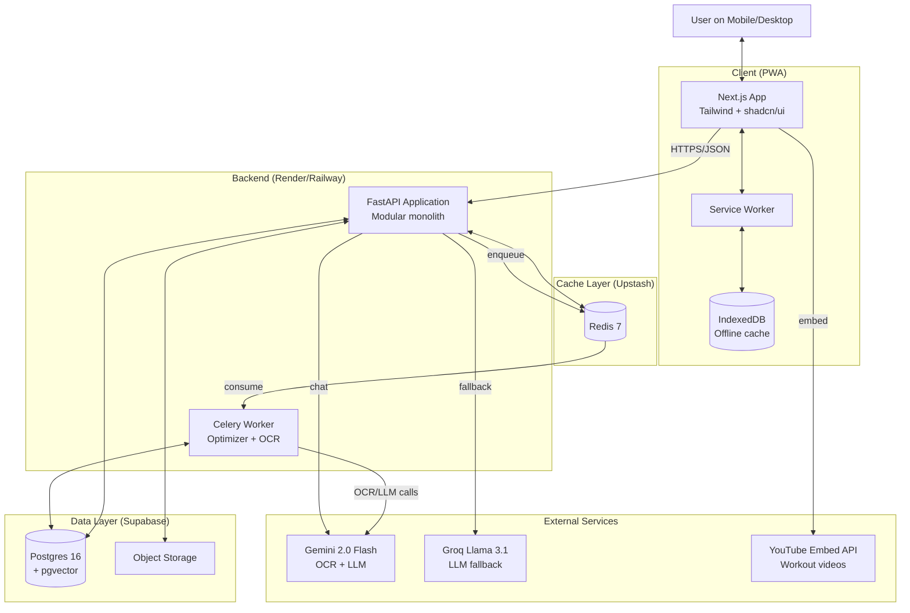
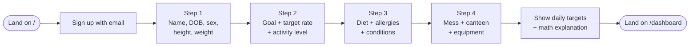
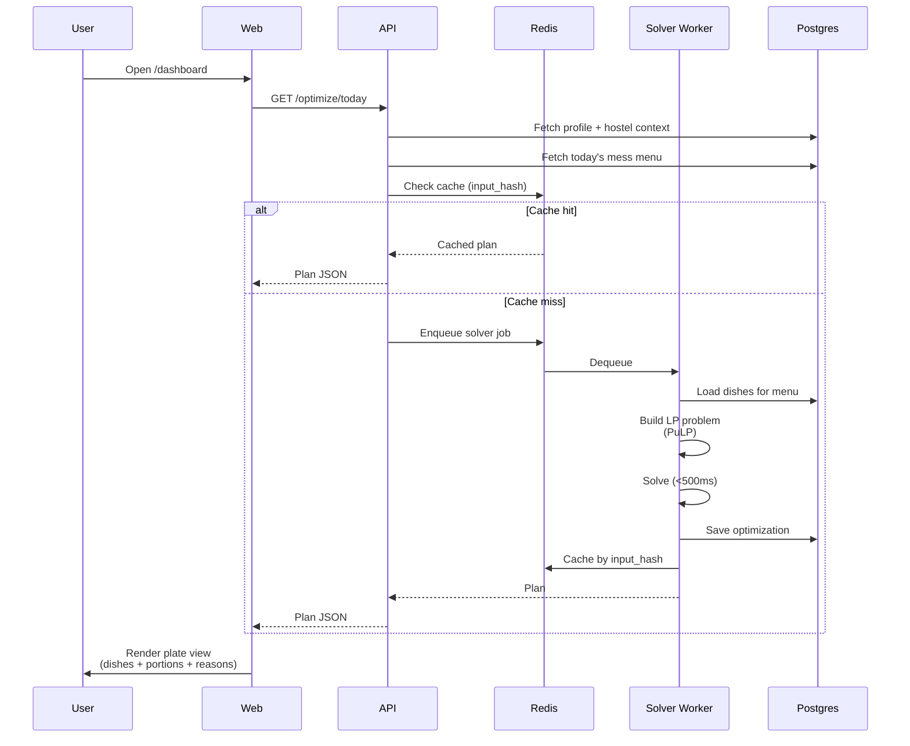
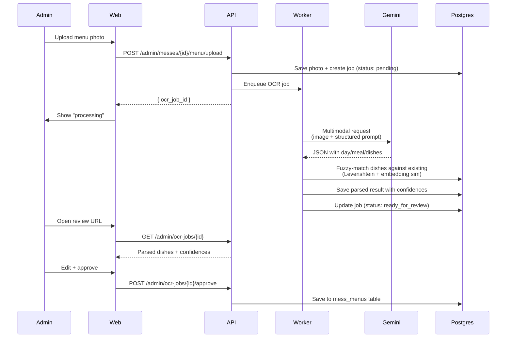
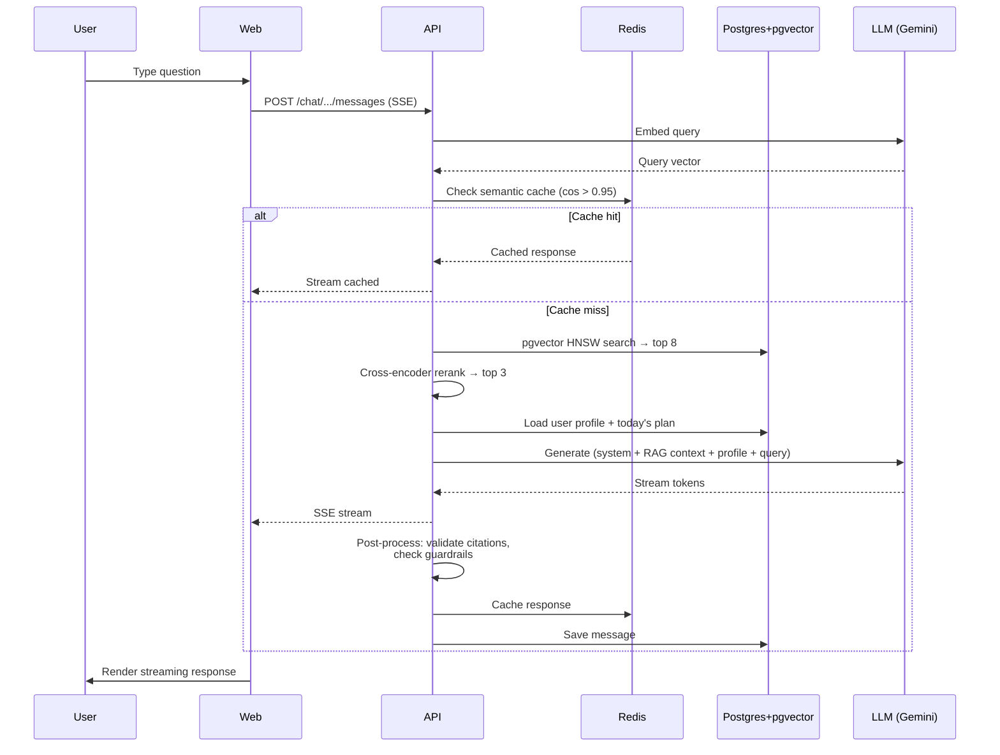
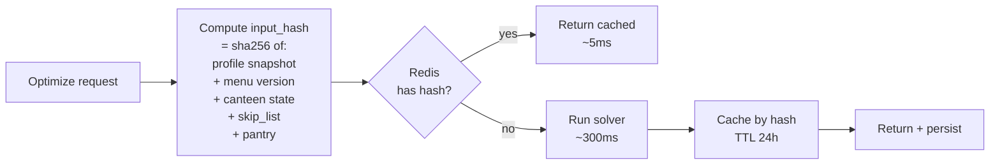
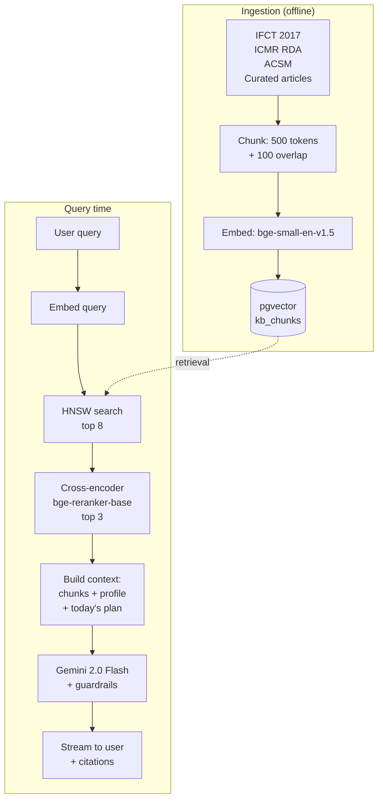
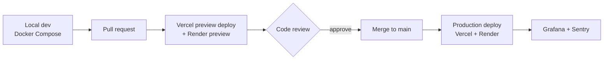

# MessFit — Technical Design Document

| | |
|---|---|
| **Version** | 1.0 |
| **Companion to** | `01-prd/PRD.md` |
| **Audience** | Engineering team, technical reviewers |
| **Last updated** | May 2026 |

---

## 1. Purpose

This document describes *how* MessFit is built. The PRD describes *what* and *why*. Read the PRD first.

---

## 2. System Architecture

### 2.1 High-level architecture



### 2.2 Module structure

```
messfit/
├── apps/
│   ├── web/                 # Next.js 15 frontend
│   └── admin/               # Optional: separate admin if needed
├── services/
│   └── api/                 # FastAPI backend (modular monolith)
│       ├── auth/            # Supabase JWT verification
│       ├── profile/         # User profile + goal engine
│       ├── mess/            # Mess + dish + menu CRUD
│       ├── optimizer/       # Plate optimization (calls Celery)
│       ├── workouts/        # Workout templates + exercise DB
│       ├── logging/         # Daily logs + progress queries
│       ├── chatbot/         # RAG pipeline + LLM
│       ├── content/         # Educational articles
│       ├── admin/           # Admin endpoints
│       ├── observability/   # OTel + structured logging
│       └── shared/          # Pydantic models, db, errors
├── workers/
│   └── optimizer/           # Celery worker for solver + OCR
├── packages/
│   ├── shared-types/        # TS types shared web↔backend
│   └── eval/                # Evaluation harness
├── infra/
│   ├── docker-compose.yml   # Local dev
│   └── migrations/          # Alembic migrations
└── docs/                    # PRD, TDD, ADRs, runbooks
```

### 2.3 Why a modular monolith (not microservices)

For a 2-person team and a pilot of 10 users, microservices add deployment complexity without benefit. We deploy one FastAPI app + one Celery worker. Module boundaries inside the codebase enforce separation; we can extract services later if scale demands.

---

## 3. User Flows

### 3.1 Onboarding flow



### 3.2 Daily plate generation flow



### 3.3 Mess menu OCR flow (admin)



### 3.4 Chatbot flow



---

## 4. Data Model

### 4.1 ER diagram

```mermaid
erDiagram
    users ||--|| profiles : has
    users ||--|| hostel_contexts : has
    users ||--o{ optimizations : generates
    users ||--o{ meal_logs : logs
    users ||--o{ weight_logs : logs
    users ||--o{ workout_logs : logs
    users ||--o{ subjective_logs : logs
    users ||--o{ chatbot_conversations : owns
    chatbot_conversations ||--o{ chatbot_messages : contains

    messes ||--o{ mess_menus : has
    messes ||--o{ hostel_contexts : "selected by users"

    mess_menus }o--|| dishes : references

    workout_templates ||--o{ workout_logs : "logged for"

    kb_documents ||--o{ kb_chunks : "split into"

    users {
        uuid id PK
        text email UK
        text display_name
        text role
        timestamptz created_at
        timestamptz onboarded_at
    }

    profiles {
        uuid user_id PK_FK
        date dob
        text sex
        numeric height_cm
        numeric current_weight_kg
        numeric target_weight_kg
        numeric target_rate_kg_per_week
        text goal
        int activity_level
        text diet_type
        text_array allergies
        text_array conditions
    }

    hostel_contexts {
        uuid user_id PK_FK
        uuid mess_id FK
        text canteen_freq
        int canteen_typical_spend_inr
        int top_up_budget_inr_weekly
        text_array equipment
        int workout_minutes_per_day
        int workout_days_per_week
        text_array gym_access_days
    }

    messes {
        uuid id PK
        text name
        text college
        text city
        uuid seeded_by FK
    }

    dishes {
        uuid id PK
        text name
        jsonb name_local
        text category
        text default_serving_unit
        numeric default_serving_grams
        numeric kcal
        numeric protein_g
        numeric carbs_g
        numeric fats_g
        numeric fiber_g
        numeric sodium_mg
        int glycemic_index
        text_array allergens
        text_array tags
        text portion_icon
        text confidence
        text source
    }

    mess_menus {
        uuid id PK
        uuid mess_id FK
        date effective_from
        date effective_to
        int day_of_week
        text meal_type
        uuid dish_id FK
        text availability
    }

    optimizations {
        uuid user_id PK_FK
        date date PK
        text input_hash
        jsonb output_json
        text solver_status
        int solve_time_ms
        numeric total_kcal
        numeric total_protein_g
    }

    meal_logs {
        uuid user_id FK
        date date
        text meal_type
        text status
        text notes
        text photo_url
    }

    weight_logs {
        uuid user_id PK_FK
        date date PK
        numeric weight_kg
    }

    workout_logs {
        uuid user_id FK
        date date
        text template_id
        jsonb exercises_done
        text status
        text skip_reason
    }

    subjective_logs {
        uuid user_id FK
        date date
        int energy
        int hunger
        int mood
    }

    workout_templates {
        text id PK
        text name
        text goal
        text_array equipment_required
        int duration_minutes
        int days_per_week
        jsonb structure
    }

    kb_documents {
        uuid id PK
        text source
        text title
    }

    kb_chunks {
        uuid id PK
        uuid document_id FK
        text content
        vector embedding
        jsonb metadata
    }

    chatbot_conversations {
        uuid id PK
        uuid user_id FK
        timestamptz created_at
    }

    chatbot_messages {
        uuid id PK
        uuid conversation_id FK
        text role
        text content
        jsonb citations
        timestamptz created_at
    }
```

### 4.2 Critical indexes

| Index | On | Type | Reason |
|---|---|---|---|
| `idx_mess_menus_lookup` | `(mess_id, day_of_week, meal_type)` | btree | Hot path: fetch today's menu |
| `idx_optimizations_user_date` | `(user_id, date)` | btree unique | Cache lookup |
| `idx_meal_logs_user_date` | `(user_id, date)` | btree | Progress queries |
| `idx_kb_chunks_embedding` | `embedding` | HNSW (pgvector) | Chatbot retrieval |
| `idx_dishes_tags` | `tags` | GIN | Filter by tag (high_protein, low_gi) |

### 4.3 Row-Level Security (Postgres + Supabase)

Every user-owned table gets RLS policies:

```sql
ALTER TABLE profiles ENABLE ROW LEVEL SECURITY;
CREATE POLICY profiles_select ON profiles
  FOR SELECT USING (user_id = auth.uid());
CREATE POLICY profiles_modify ON profiles
  FOR ALL USING (user_id = auth.uid());

-- Admin override
CREATE POLICY admin_all ON profiles
  FOR ALL USING (
    EXISTS (SELECT 1 FROM users WHERE id = auth.uid() AND role = 'admin')
  );
```

---

## 5. The Optimizer (Engineering Core)

### 5.1 Problem formulation

For each dish $d$ available today and meal slot $m$, the variable $x_{d,m} \in [0, \text{max\_portions}_d]$ represents portions consumed.

**Objective** (minimize):

$$w_p(P-P^*)^2 + w_k(K-K^*)^2 + w_c(C-C^*)^2 + w_f(F-F^*)^2 + w_b \cdot \text{budget\_used}$$

with weights $w_p=2.0$, $w_k=1.5$, $w_c=1.0$, $w_f=1.0$, $w_b=0.1$.

**Hard constraints:**

| # | Constraint |
|---|---|
| C1 | $0.9 K^* \leq K \leq 1.1 K^*$ (calorie band) |
| C2 | $P \geq 0.85 P^*$ (protein floor) |
| C3 | $x_{d,m} = 0$ if dish contains user allergen |
| C4 | $x_{d,m} = 0$ if dish violates diet type (non-veg for veg user, etc.) |
| C5 | Diabetes: dishes with GI > 70 capped at 0.5 portion |
| C6 | Hypertension: dishes with sodium > 800mg/serving capped |
| C7 | Anemia: prefer iron-rich tagged dishes (soft) |
| C8 | $0 \leq x_{d,m} \leq \text{max\_portions}_d$ |
| C9 | Canteen budget: $\sum (\text{cost}_c \cdot \text{include}_c) \leq B$ |
| C10 | Canteen frequency: integer cap based on user's setting |
| C11 | Integer-only dishes (chapati, egg) get integer variables |
| C12 | No dish appears more than 2× per day |

### 5.2 Linearization

Squared deviation in the objective is non-linear. For PuLP (LP-only solver), we linearize via piecewise approximation: introduce $z = |X - X^*|$, minimize $z$, with constraints $z \geq X - X^*$ and $z \geq X^* - X$. Loses the squared penalty but acceptable for V1.

If linearization quality becomes a problem, migrate to OR-Tools CP-SAT which handles quadratic objectives natively.

### 5.3 Caching



Invalidation triggers: profile change, weight log, menu edit, skip-list change.

### 5.4 Eval framework

50 hand-crafted scenarios in `packages/eval/scenarios/`. Each scenario specifies user inputs and expected output properties. Nutritionist provides "would you give this to a patient?" sign-off on optimizer outputs.

Run on every PR via GitHub Actions:

```yaml
- name: Run optimizer eval
  run: pytest packages/eval/test_optimizer.py
- name: Check pass rate
  run: |
    PASS_RATE=$(jq '.pass_rate' eval-results.json)
    if (( $(echo "$PASS_RATE < 0.90" | bc -l) )); then exit 1; fi
```

---

## 6. AI/ML Pipeline

### 6.1 LLM usage map

| Use case | Model | Latency budget | Cost concern |
|---|---|---|---|
| Mess menu OCR | Gemini 2.0 Flash | ~5s acceptable | Low (admin only) |
| Dish nutrition fallback | Gemini 2.0 Flash | ~3s acceptable | Low (cached) |
| Reasons polish (optional) | Gemini 2.0 Flash | <300ms | Medium |
| Chatbot — primary | Gemini 2.0 Flash | First-token <1.5s | High (cache critical) |
| Chatbot — fallback | Groq Llama 3.1 70B | Same | Same |

### 6.2 RAG architecture



### 6.3 Guardrails

Enforced via system prompt + post-processing:
- Refuse medical advice (regex on output for diagnostic phrases)
- Cite sources for factual claims
- Mark itself as AI in first message
- Refuse extreme diet, eating-disorder, or rapid-loss queries
- Never recommend specific drug doses

### 6.4 Semantic cache

Hash query embedding to nearest neighbor in chat cache (cosine > 0.95). Hit returns cached response immediately. Reduces LLM cost ~60% in pilot.

---

## 7. Frontend

### 7.1 Page map

```mermaid
flowchart LR
    Land[/]
    Login[/auth/login]
    Signup[/auth/signup]
    OB1[/onboarding/profile]
    OB2[/onboarding/hostel]
    OB3[/onboarding/targets]
    Dash[/dashboard]
    Menu[/menu]
    Workout[/workout]
    Log[/log]
    Progress[/progress]
    Chat[/chat]
    Learn[/learn]
    Profile[/profile]
    Admin[/admin/...]

    Land --> Signup
    Land --> Login
    Signup --> OB1 --> OB2 --> OB3 --> Dash
    Login --> Dash
    Dash <--> Menu
    Dash <--> Workout
    Dash <--> Log
    Dash <--> Progress
    Dash <--> Chat
    Dash <--> Learn
    Dash <--> Profile
```

### 7.2 Component hierarchy (key components)

```
<App>
  <AuthProvider>
    <QueryProvider>
      <ThemeProvider>
        <Layout>
          <NavBar />
          <PageContent>
            // Page-specific
            <DashboardPage>
              <DailyTotals>
                <MacroProgressBar protein />
                <MacroProgressBar kcal />
              </DailyTotals>
              <MealSection meal="breakfast">
                <DishCard>
                  <PortionIcon />
                  <DishName />
                  <PortionSize />
                  <Reason />
                </DishCard>
              </MealSection>
              <GapFills />
            </DashboardPage>
          </PageContent>
        </Layout>
      </ThemeProvider>
    </QueryProvider>
  </AuthProvider>
</App>
```

### 7.3 Design tokens

| Token | Value | Use |
|---|---|---|
| `--primary` | warm green | Primary actions, success |
| `--accent` | saffron orange | Accents, highlights |
| `--surface-1` | bg base | Card backgrounds |
| `--surface-2` | bg elevated | Modals, popovers |
| `--text-primary` | high contrast | Headings, body |
| `--text-secondary` | mid contrast | Subheads |
| `--text-muted` | low contrast | Captions, hints |
| Spacing | 4/8/12/16/24/32/48/64 | 4px base |
| Radius | 4/8/12/16 | Component-dependent |
| Font | Inter | All UI |

---

## 8. Tech Stack & Rationale

| Layer | Pick | Why this | Rejected |
|---|---|---|---|
| Frontend framework | Next.js 15 (App Router) | PWA-native, RSC, big ecosystem | Vite+React (less batteries), SvelteKit (smaller ecosystem) |
| UI library | shadcn/ui + Tailwind | Modern, accessible, copy-own | MUI (heavy), Chakra (less momentum) |
| Backend framework | FastAPI | Async, Pydantic, team familiarity | Django (overkill), Express (worse Python fit) |
| Database | Postgres 16 + pgvector | Single DB for relational + vector | Mongo (worse for relational), Pinecone (separate service) |
| Auth | Supabase Auth | Free, refresh tokens, RLS | Roll-our-own (bug surface), Auth0 (paid) |
| Cache + Queue | Redis + Celery | Worker queue, semantic cache | RabbitMQ (heavier) |
| Optimizer | PuLP (V1) → OR-Tools CP-SAT (if needed) | PuLP is easier to start | Gurobi ($$), DIY |
| LLM (primary) | Gemini 2.0 Flash | Cheap, multimodal, structured output | OpenAI (expensive) |
| LLM (fallback) | Groq Llama 3.1 70B | Fast first-token | — |
| Embeddings | bge-small-en-v1.5 | Free, CPU-runnable | OpenAI ada (paid) |
| Frontend host | Vercel | Free tier, auto-deploy | Netlify, CF Pages |
| Backend host | Render or Railway | Free tier, Docker-native | AWS (overkill), GCP Cloud Run (fine alt) |
| Storage | Supabase Storage | Bundled, free 1GB | S3 (separate) |
| Observability | OpenTelemetry → Grafana Cloud free tier | Vendor-neutral | Datadog (paid) |
| Errors | Sentry free tier | 5K events/mo | — |
| Analytics | PostHog | Privacy-respecting | GA4 |
| CI/CD | GitHub Actions | Free for public repos | — |
| Package mgr (Python) | uv | 10–100× faster than pip, deterministic | pip, poetry |
| Package mgr (Node) | pnpm | Fast, disk-efficient, monorepo-friendly | npm, yarn |
| Mobile (V1) | PWA | Single codebase, installable | Native (too much for 2 ppl), RN (V2 maybe) |

---

## 9. Observability

### 9.1 What we measure

**RED metrics per endpoint:** Rate, Errors, Duration (p50/p95/p99).

**Business metrics:** DAU, WAU, signups, optimizations/day, daily logs/active user, adherence rate (rolling 7d).

**System metrics:** DB pool usage, Redis hit rate, optimizer solve time, optimizer cache hit rate, LLM cost/day, LLM tokens/request.

### 9.2 Tracing

Instrument with OpenTelemetry SDK:
- Every API endpoint
- Optimizer solve (each constraint set)
- LLM calls (model, tokens, cost)
- DB queries (heavy ones)
- Embedding generation
- pgvector retrieval

### 9.3 Alerts

| Condition | Threshold | Channel |
|---|---|---|
| API p95 latency | >1s for 5 min | Discord webhook |
| Error rate | >5% for 5 min | Discord webhook |
| Optimizer infeasibility | >20% | Discord webhook |
| LLM cost/day | >₹100 | Discord webhook (early warning) |
| DB pool | >80% | Discord webhook |
| Disk | >80% | Discord webhook |

---

## 10. Security & Privacy

### 10.1 Auth & authorization
- Supabase Auth (email + password)
- JWT access (1h) + refresh (7d) with rotation
- RLS policies enforce per-user data access at DB level
- Admin role check server-side on admin endpoints
- Auth rate limit: 5 attempts / 15 min / IP

### 10.2 Data protection
- All PII (height, weight, conditions) treated as health data
- TLS 1.3 in transit
- Postgres TDE at rest (Supabase default)
- No PII in logs (only `user_id`)
- LLM prompts: no PII beyond pseudonymized profile snapshot

### 10.3 DPDP Act 2023 compliance
- Privacy policy + consent at signup
- Purpose-limited collection
- User rights: access, correct, erase, port
- Data processor agreements (Supabase, Vercel, Gemini DPAs reviewed)
- Hard delete within 30 days of account deletion

### 10.4 Threat model

| Threat | Mitigation |
|---|---|
| Account takeover | Rate-limited auth, password rules, future 2FA |
| API abuse / DoS | Rate limits per user + IP (Redis) |
| LLM prompt injection | System prompt hardening, length limits, output validation |
| Data leak via LLM | Never send raw PII; pseudonymize |
| SQL injection | SQLAlchemy parameterized queries enforced |
| XSS | React escapes by default; never `dangerouslySetInnerHTML` for user content |
| CSRF | SameSite=Lax cookies + CSRF tokens |
| Dependency vulns | Dependabot, Snyk free tier |
| Admin abuse | Audit log of all admin actions |

---

## 11. Performance Targets

| Metric | Target |
|---|---|
| TTFP (dashboard, 4G) | <1.5s |
| TTI (dashboard, 4G) | <2.5s |
| API p50 / p95 / p99 | 50ms / 300ms / 800ms |
| Optimizer p95 (cold) | <500ms |
| Optimizer p95 (cached) | <50ms |
| Chatbot first-token p95 | <1.5s |
| Chatbot total response p95 | <8s |
| OCR pipeline p95 | <15s |
| Mobile bundle (gzipped) | <250KB initial |
| Lighthouse mobile | ≥90 across all categories |

---

## 12. Deployment & Environments



**Environments:**
- **Local dev:** docker-compose (Postgres + Redis), `.env.local`, hot reload
- **Preview:** Auto-deploy per PR, ephemeral DB
- **Production:** Vercel (frontend) + Render (backend) + Supabase (DB) + Upstash (Redis)

---

## 13. Open Technical Questions

1. **Linearization vs CP-SAT:** Start with PuLP linearization; upgrade to CP-SAT only if eval pass rate drops below 90%.
2. **YouTube embed legality:** Confirmed via official embed API ToS; safe.
3. **IFCT licensing:** Public document, attribution-only; safe.
4. **ICMR RDA copyright:** Same; safe to use as RAG source.
5. **Service Worker complexity:** Use Workbox to avoid hand-rolling; standard recipes for static + API caching.
6. **State sync between mobile and web:** Same backend; PWA installs handle both.

---

## 14. Glossary

See `01-prd/PRD.md` § Glossary equivalents. Key technical terms recap:

- **MILP:** Mixed-Integer Linear Programming
- **CP-SAT:** Constraint Programming with SAT solver
- **PuLP:** Python LP modeling library
- **HNSW:** Hierarchical Navigable Small World (vector index)
- **RAG:** Retrieval-Augmented Generation
- **RLS:** Row-Level Security (Postgres)
- **OTel:** OpenTelemetry
- **TDD:** Technical Design Document (this file)
- **ADR:** Architecture Decision Record
- **DPDP:** Digital Personal Data Protection Act 2023 (India)

---

*Companion documents: `01-prd/PRD.md` (product spec), `03-phases/` (build plan).*
